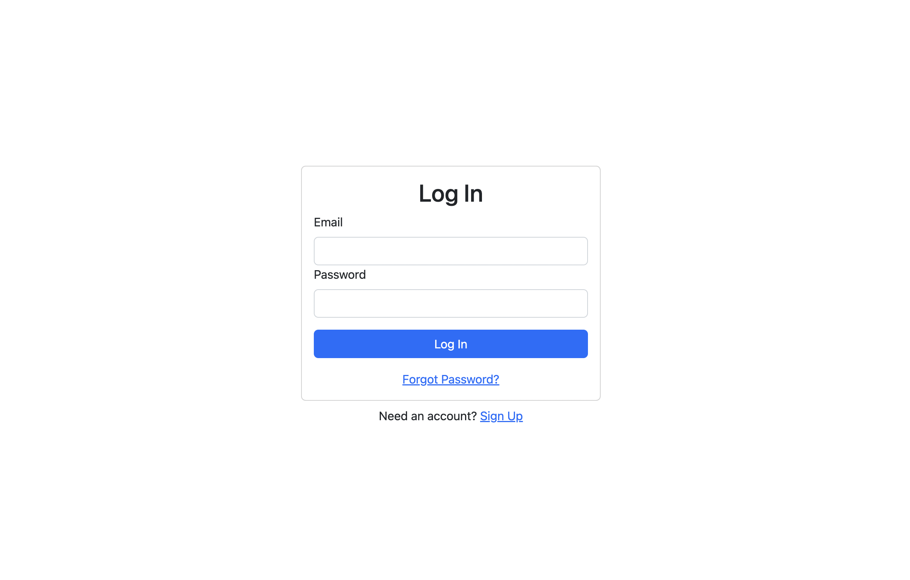
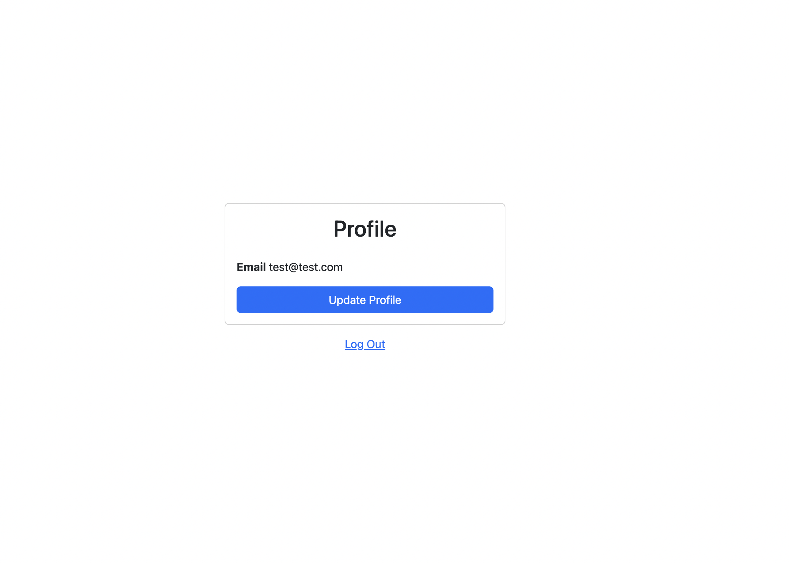
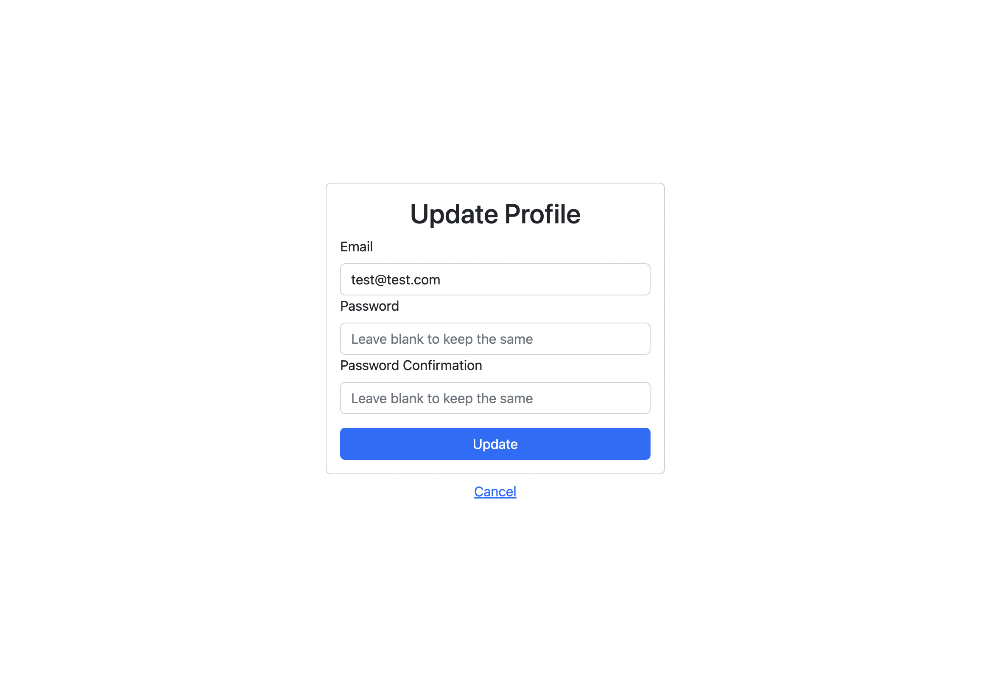

# React-Authentication





## Tools
* React
* Context Api
* Firebase
* React Bootstrap

## Features
* You can sign-in/sign-up
* Update email
* Update password

## Usage
```
npm install
npm start
```


